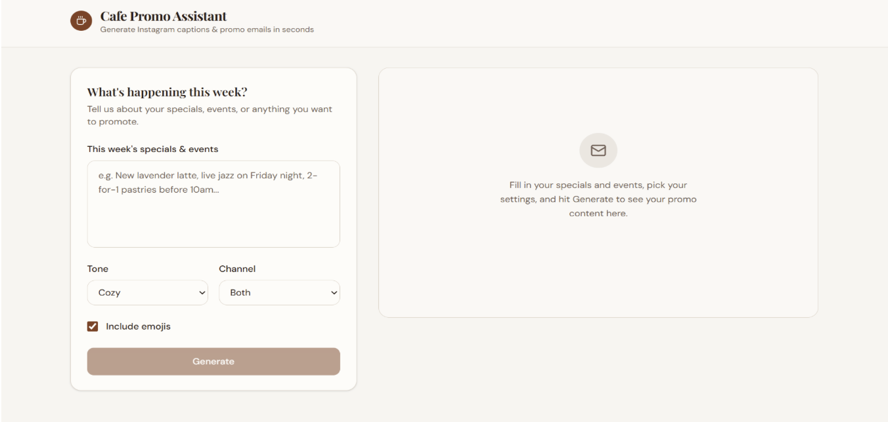
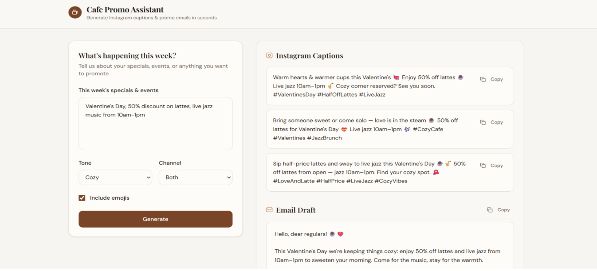

# Mocha

Mocha is an AI-powered café marketing assistant that helps neighborhood cafés create promotional content faster and more consistently.

## Overview

Small cafés and local businesses often spend too much time creating Instagram posts, promo emails, and campaign ideas manually. Mocha was designed to streamline that process by turning a short description of weekly specials or events into ready-to-use marketing content through an AI-assisted workflow.

## Features

- Generate 3 Instagram captions from simple business inputs
- Generate a newsletter-style promo email for the same campaign
- Let users choose tone, output channel, and emoji preferences
- Support faster first drafts for weekly café promotions
- Use prompt guardrails to improve output quality and reduce invented offers

## Tech Stack

- v0
- Next.js
- TypeScript
- CSS
- GPT-4o-mini
- AI-assisted prompt workflow

## My Role

- Identified the problem through user research with a local café manager
- Defined the product concept and target workflow
- Designed the prototype experience in v0
- Iterated on prompts to control tone, length, emojis, hashtags, and email quality
- Added guardrails to reduce incorrect or unrealistic promotional outputs
- Tested the prototype with a real user and incorporated feedback into later iterations

## User Research & Validation

Mocha was informed by a semi-structured interview and lightweight user testing with a local café manager responsible for weekly promotions and day-to-day marketing.

Key findings:

- Drafting a week’s posts and promo email could take roughly 15–20 minutes
- Starting from a blank page was the hardest part
- The user cared most about tone, voice, and whether the copy felt realistic and post-ready
- With Mocha, drafting content took about 3–5 minutes and felt easier to start

The café manager said Mocha “made it much easier to get started” and “sounded like something I’d actually post.”

See the full case study in [`docs/mocha-case-study.md`](./docs/mocha-case-study.md).

## Impact

- Reduced small-business content drafting time from roughly 15–20 minutes to about 3–5 minutes in user testing
- Explored how AI can support lightweight marketing workflows for local businesses
- Demonstrated how prompt iteration and user feedback can improve the usefulness of AI-generated content

## Repository Structure

- `app/` – application pages and routing
- `components/` – reusable UI components
- `hooks/` – frontend hooks
- `lib/` – utility logic
- `public/` – static assets
- `scripts/` – supporting scripts
- `docs/` – case study and supporting writeups
- `screenshots/` – UI screenshots and visuals

## Running Locally

```bash
pnpm install
pnpm dev
```

Then open [http://localhost:3000](http://localhost:3000).

## Screenshots

### Input form


### Generated output



## Future Improvements

- Add brand voice customization for different café styles
- Add campaign history and editing workflows
- Add feedback loops for output quality
- Recommend the best format for a promotion, such as a feed post, story, reel, or email
- Suggest timing and reusable templates based on the promotion context
